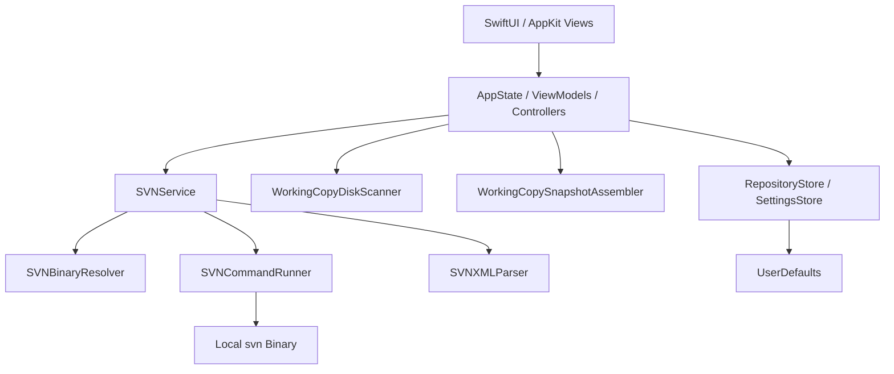

# Architecture

本文档描述 SVNMate 当前版本的实际架构和关键设计取舍，面向维护者、贡献者和代码评审者。

## 1. 项目定位

SVNMate 的目标不是成为“覆盖 SVN 全量能力的平台型客户端”，而是做成一个可维护的 macOS 工作副本操作工具。

当前版本重点解决：

- 打开已有工作副本
- 新建 checkout
- 浏览真实工作副本目录树
- 状态可视化
- 批量 add / commit
- diff / update / cleanup / resolve
- 基础设置、本地化和桌面分发

## 2. 关键设计原则

- 不嵌入 SVN 库，直接复用本地 `svn` 二进制
- 用 XML 解析代替面向人类的文本列宽解析
- 将 UI、命令执行、解析、工作副本组装和设置持久化解耦
- 保持工作副本模型稳定，避免 UI 直接依赖临时 UUID 或脆弱的文本解析结果

## 3. 总体架构

## 4. UI 与状态层

### 4.1 `AppState`

负责全局应用状态：

- 仓库列表
- 当前选中仓库
- checkout 弹窗状态
- 全局成功/失败提示

### 4.2 `RepositoryViewModel`

负责仓库级编排：

- 加载工作副本快照
- 维护文件树展开状态
- 处理 add / commit / update / cleanup / diff / resolve
- 维护 tree conflict 详情和 issue 区

### 4.3 `SettingsController`

负责全局设置运行时状态：

- `svn` 路径 override
- 超时配置
- 强调色和状态颜色
- 语言覆盖设置

### 4.4 `LocalizationController`

负责语言解析和运行时切换：

- `System / zh-Hans / en`
- 系统语言回退策略
- `Locale` 和自定义 `AppLocalizer` 注入

### 4.5 `MenuBarController`

负责菜单栏摘要：

- 当前仓库摘要刷新
- issue 数量
- 菜单栏错误状态

## 5. SVN 执行链路

### 5.1 `SVNBinaryResolver`

按以下顺序定位 `svn`：

1. 环境变量 `SVN_BINARY_PATH`
2. Settings 中的用户覆盖路径
3. 默认路径
   - `/usr/bin/svn`
   - `/opt/homebrew/bin/svn`
   - `/usr/local/bin/svn`

设计目标是避免依赖 shell PATH，减少桌面应用环境差异。

### 5.2 `SVNCommandRunner`

负责：

- 启动 `Process`
- 关闭 `stdin`，避免交互阻塞
- timeout
- cancel
- stdout / stderr 流式输出
- 统一错误包装

Checkout 的进度展示也是基于这层的流式输出能力实现的。

### 5.3 `SVNXMLParser`

当前主要解析：

- `svn info --xml`
- `svn status --xml`
- `svn info --xml <path>` 中的 tree conflict detail

这样做的收益：

- 避免脆弱的列宽文本解析
- 不同 SVN 版本间兼容性更好
- 便于后续扩展 `log --xml` 等能力

### 5.4 `SVNService`

`SVNService` 是对外 facade，负责编排：

- 命令参数
- 二进制解析
- timeout 策略
- 解析和返回统一模型

## 6. 工作副本模型

当前文件树不是“仅展示变更列表”，而是：

- 以磁盘真实目录扫描为主
- 叠加 `svn status --xml --depth infinity --no-ignore` 的状态索引

### 6.1 磁盘树

由 `WorkingCopyDiskScanner` 负责：

- 按真实目录结构构建
- 隐藏 `.svn`
- 支持展开目录时懒加载子节点

### 6.2 状态 overlay

由 `WorkingCopyStatusIndex` 提供：

- 文件显式状态
- 目录聚合状态
- issue 集合

### 6.3 快照组装

`WorkingCopySnapshotAssembler` 负责把：

- 磁盘节点
- SVN 状态
- issue

组合成最终 UI 消费的 `WorkingCopySnapshot`。

### 6.4 目录状态聚合

目录本身常常没有直接的 SVN 状态，因此目录展示状态由子树聚合得到，用于让用户快速发现：

- 冲突目录
- 有变更目录
- 含未纳管文件目录

## 7. 选择性 Add / Commit 设计

当前交互模型是：

- 主树展示全部磁盘文件
- 勾选框只出现在可操作文件上
- `Unversioned` 用于 add
- `Modified / Added / Deleted / Replaced` 用于 commit

提交流会额外处理：

- 自动补齐 `.added` 祖先目录
- 提交前重新做一次最新状态 preflight
- 若祖先目录存在 tree conflict，则直接阻断提交

## 8. Tree Conflict 设计

Tree conflict 支持两层能力：

1. 状态层识别  
`svn status --xml` 中只要 `tree-conflicted="true"`，就强制映射为 `Conflict`

2. 详情层展示  
选中冲突路径时，通过 `svn info --xml <path>` 解析：

- reason
- action
- operation
- victim
- source-left / source-right

这使 UI 不只是显示“有冲突”，还可以展示冲突成因。

## 9. 设置与主题

当前设置持久化在 `UserDefaults`，包含：

- `svn` 路径 override
- 超时
- accent color
- 状态颜色
- 语言

这部分设计目标是：

- 对后续命令立即生效
- 不影响已经在运行中的命令
- 保持桌面配置轻量化，不污染工作副本目录

## 10. 本地化设计

当前支持：

- `zh-Hans`
- `en`

策略为：

- 默认跟随系统语言
- 不支持的系统语言回退到简体中文
- 可在 Settings 中手动覆盖

实现上：

- `Localizable.strings`
- `Locale`
- 自定义 `AppLocalizer`

组合使用，以同时覆盖 SwiftUI 文本和模型层动态文案。

## 11. 打包与分发

当前交付链路基于：

- `project.yml`
- `xcodegen`
- `xcodebuild`
- `scripts/package_dmg.sh`

生成产物：

- `dist/SVNMate.app`
- `dist/SVNMate-macOS.dmg`

这条链路当前适合内部测试分发，不等同于正式发布链路。

## 12. 当前边界

当前架构有意不覆盖：

- SVN 凭据管理 UI
- 历史浏览、branch/tag、merge assistant
- 正式签名、公证与外部分发
- 对原始 SVN 服务器错误做全文本地化

这保证了系统复杂度仍控制在“可维护桌面工具”的范围内。
