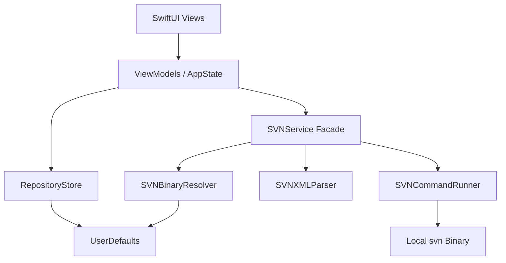

# SVNMate 设计文档

## 1. 项目定位

SVNMate 是一个面向 macOS 的原生 SVN 客户端，目标是提供比命令行更低操作成本的工作副本管理能力，同时保留对本地 `svn` 二进制的兼容性。

当前版本的设计目标不是覆盖 SVN 全量能力，而是先形成一个稳定的工作副本操作闭环：

- 打开本地工作副本
- 从远程仓库执行检出
- 查看工作副本状态树
- 查看文件 diff
- 按选中文件提交
- 执行 update / cleanup / resolve

## 2. 设计目标与约束

### 2.1 设计目标

- 使用 macOS 原生交互模型实现桌面客户端，而不是 Web 包壳
- 通过本地 `svn` 命令兼容既有企业 SVN 基础设施
- 将 UI 状态、命令执行、XML 解析、仓库存储解耦，避免后续继续演化成单体文件
- 优先保证稳定性和可维护性，而不是一次性堆叠高级功能

### 2.2 约束条件

- 不内嵌 SVN 库，依赖系统或用户安装的 `svn` 可执行文件
- 当前版本未实现独立认证设置页与凭据管理页
- 当前版本未实现 branch/tag、merge assistant、图形化历史浏览
- 当前版本主要针对单机桌面使用场景，数据持久化采用 `UserDefaults`

## 3. 总体架构

当前工程采用典型的本地桌面应用分层：



### 3.1 分层职责

- Views：负责桌面交互与状态展示
- ViewModels / AppState：负责页面级状态与用户操作编排
- Services：负责 SVN 二进制发现、命令执行、XML 解析、仓库持久化
- Models：负责仓库、文件节点、状态枚举与错误模型

## 4. 核心模块设计

### 4.1 App 层

`AppState` 管理全局仓库列表、当前选中仓库、弹窗状态、全局提示信息。

核心职责：

- 启动时从 `RepositoryStore` 加载仓库列表
- 处理“打开仓库”与“新增检出”后的仓库接入
- 维护全局成功/失败提示

### 4.2 页面视图层

#### `ContentView`

- 提供 `NavigationSplitView` 主框架
- 左侧展示仓库列表
- 右侧展示欢迎页或仓库详情页

#### `RepositoryDetailView`

- 展示工作副本文件树
- 管理当前选中文件
- 管理勾选提交文件集合
- 弹出提交窗口并将选中文件路径传递给 `RepositoryViewModel`

### 4.3 ViewModel 层

#### `RepositoryViewModel`

负责仓库级操作编排：

- `loadFiles`
- `update`
- `commit`
- `cleanup`
- `showDiff`
- `resolve`

设计原则：

- 所有 SVN 操作都通过 `SVNService` 进入
- UI 层不直接接触 `Process`
- 错误统一回收到 `errorMessage`

### 4.4 服务层

#### `SVNBinaryResolver`

负责解析 `svn` 可执行文件路径，解析顺序如下：

1. 环境变量 `SVN_BINARY_PATH`
2. `UserDefaults` 中的 `SVNMate.svnBinaryPath`
3. 默认路径
   - `/usr/bin/svn`
   - `/opt/homebrew/bin/svn`
   - `/usr/local/bin/svn`

这样做的原因：

- 避免依赖 shell PATH，减少桌面应用运行环境差异
- 兼容系统自带 SVN 与 Homebrew 安装场景
- 为后续增加设置页预留扩展点

#### `SVNCommandRunner`

负责实际命令执行，输出结构化结果：

- executable path
- arguments
- stdout
- stderr
- exit code

当前能力：

- 支持 timeout
- 支持任务取消时终止进程
- 非零退出码统一包装为 `SVNError`

#### `SVNXMLParser`

解析以下 XML 输出：

- `svn info --xml`
- `svn status --xml`

设计取舍：

- 不再依赖面向人类的文本列宽解析
- 提升不同 SVN 版本间的兼容性
- 为后续 `log --xml`、`list --xml` 扩展保留统一范式

#### `RepositoryStore`

负责仓库列表持久化：

- 读取 `UserDefaults`
- 过滤本地已不存在的仓库路径
- 保存最近打开仓库列表

## 5. 关键数据模型

### 5.1 Repository

字段：

- `path`
- `url`
- `name`
- `lastUpdate`

关键设计：

- 使用 `path` 作为稳定标识，而不是运行时生成 UUID
- 有利于列表选择、仓库去重与持久化恢复

### 5.2 FileNode

字段：

- `path`
- `name`
- `isDirectory`
- `status`
- `children`

关键设计：

- 使用相对路径作为稳定 ID
- 文件树可补全缺失父目录
- 文件节点带有 `isSelectableForCommit`，避免 UI 层重复判断

### 5.3 FileStatus

当前覆盖状态：

- normal
- modified
- added
- deleted
- unversioned
- conflict
- ignored
- missing
- replaced
- external

## 6. 关键流程设计

### 6.1 打开本地仓库

1. 用户选择本地目录
2. `AppState.addRepository(at:)` 调用 `SVNService.info`
3. `SVNXMLParser` 解析仓库 URL 与修订信息
4. 构造 `Repository`
5. 保存到 `RepositoryStore`
6. 将仓库切换为当前选中项

### 6.2 工作副本状态加载

1. `RepositoryViewModel.loadFiles()`
2. 调用 `svn status --xml`
3. `SVNXMLParser` 生成 `NodeRecord`
4. 自动补齐缺失父目录
5. 构建稳定文件树返回 UI

### 6.3 选择性提交

1. 用户在文件树勾选可提交文件
2. UI 保存勾选文件的相对路径集合
3. 打开提交窗口填写 message
4. `RepositoryViewModel.commit(message:files:)`
5. `SVNService.commit` 将所选文件路径附加到 `svn commit -m`

兼容策略：

- 如果未勾选文件，则保持仓库范围提交行为
- unversioned / ignored / conflict / missing 等状态默认不加入选择

### 6.4 差异查看

1. 用户选择文件
2. 点击 `View Diff`
3. 调用 `svn diff <file>`
4. 将 stdout 以等宽字体显示在右侧详情区域

## 7. 错误处理设计

当前错误处理采用“本地统一包装 + UI 友好提示”的方式：

- 找不到 `svn` 可执行文件：由 `SVNBinaryResolver` 返回明确错误
- 命令启动失败：由 `SVNCommandRunner` 返回启动错误
- 命令超时：返回 timeout 错误
- 命令非零退出：优先展示 stderr，stdout 作为兜底
- XML 解析失败：返回解析错误，避免 silent failure

## 8. 当前功能边界

### 8.1 已支持

- 本地仓库打开
- 远程 checkout
- 工作副本状态展示
- 选中文件提交
- 文件 diff
- update
- cleanup
- resolve

### 8.2 已实现底层接口但 UI 未完整开放

- `log`
- 更丰富的仓库信息展示

### 8.3 未支持

- 账号密码与证书设置页
- Keychain 凭据管理
- branch/tag 浏览与创建
- merge assistant
- 历史图形化视图
- 多仓库并发任务调度

## 9. 风险与后续演进

### 9.1 当前风险

- 不同 SVN 版本 XML 结构可能存在字段差异
- 认证失败场景仍依赖 `svn` 自身行为，缺少桌面化恢复路径
- 提交粒度目前仅支持文件级，不支持更精细的 hunk 级选择
- `UserDefaults` 适合当前规模，但不适合承载任务历史、认证策略、复杂偏好

### 9.2 下一阶段建议

建议按以下顺序继续演进：

1. 增加凭据管理与认证失败恢复
2. 引入统一任务中心，支持进度、取消、重试
3. 增加 `log` / `info` / revision 浏览 UI
4. 增加设置页，允许用户配置 svn binary path、默认 diff 策略、超时时间
5. 增加打包、签名、notarization 流程

## 10. 代码目录建议

当前建议采用如下目录划分：

```text
SVNMate/Sources/
├── App/
├── Models/
├── Services/
└── Views/
```

该结构适合当前规模；若后续继续扩展，可再按领域拆分为：

- `Features/Repositories`
- `Features/WorkingCopy`
- `Features/Commit`
- `Infrastructure/SVN`
- `Infrastructure/Persistence`

## 11. 文档对应关系

- 本文档：说明系统设计与工程边界
- 使用手册：面向最终使用者说明如何使用客户端
- 安装部署手册：面向开发、测试、交付人员说明如何构建、安装、发布
